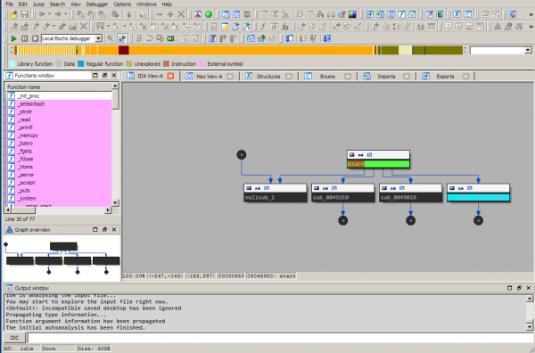
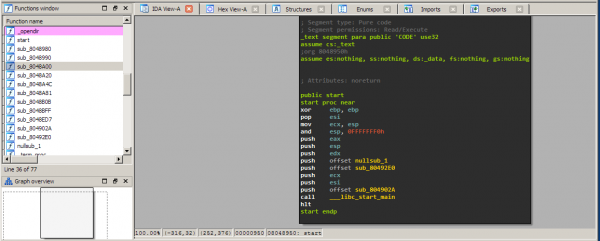
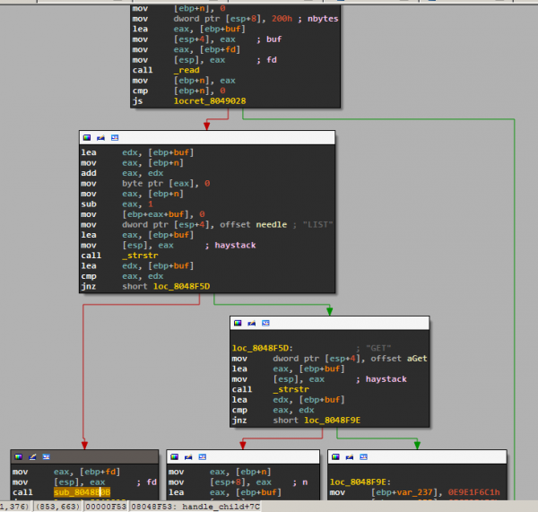

# Table of Contents
   * [Introduction](#introduction)
   * [Disassembling executables](#disassembling-executables)
      * [Linear Sweep](#linear-sweep)
      * [Recursive Traversal](#recursive-traversal)
   * [IDA and Ghidra](#ida-and-ghidra)
      * [IDA tips &amp; tricks](#ida-tips--tricks)
      * [IDA Pro and Ghidra](#ida-pro-and-ghidra)
   * [C++](#c)
   * [Further reading](#further-reading)
   * [Challenges](#challenges)
      * [04. crypto_crackme](#04-crypto_crackme)
      * [05. broken](#05-broken)
      * [06. hyp3rs3rv3r](#06-hyp3rs3rv3r)

# Introduction
Sometimes we are either unable or reluctant to run an unknown executable. This inability to run the file can be caused by a multitude of factors, such as not having the correct dependencies or runtimes for it. In addition, it is often unsafe to run binaries without analysing them first. Today we'll learn about one method of analysis, called **static analysis**.

Thus, static analysis allows us to understand the behaviour of the application by displaying either its assembly code or an equivalent high-level code. In order to obtain the assembly code, via a procedure called **disassembling**, currently there are two approaches being used, which we'll describe in the following sections. The high-level code, is *deduced* from the machine code, through a more complex process called **decompilation**, which sometimes might make it a bit inaccurate, when compared to the assembly code.

# Disassembling executables
There are two main strategies when it comes to disassembly. They are called **Linear Sweep** and **Recursive Traversal**. As we'll see below, the main difference between the two is their accuracy

## Linear Sweep
The first strategy that we'll look at is *Linear Sweep*. A very popular tool that uses this strategy is `objdump`. What *Linear Sweep* does is it parses the `.text` section of the executable from the beginning to the end and translates each encountered machine code instruction into its equivalent Assembly instruction. It's a fast and simple algorithm. Being so simple, however, renders it vulnerable to being mislead. This can happen in a few ways. One way is to insert an inappropriate instruction somewhere in the `.text` section. When the algorithm reaches it, it will try to interpret it as something meaningful and output a completely different Assembly code that would make no sense.

Let's consider the code below, which is also available [in this repo](https://github.com/hexcellents/sss-exploit/blob/master/sessions/04-static-analysis/activities/01-tutorial-disassemble-methods/src/wrong.c):
```c
int main()
{
	asm volatile(
		"A: jmp B\n\t"
		".byte 0xde\n\t"
		".byte 0xad\n\t"
		".byte 0xc0\n\t"
		".byte 0xde\n\t"
		"jmp -1\n\t"
		"B:\n\t"
	);
	printf("What is wrong with me :-s?\n");
	return -1;
}
```

Take a look at the Makefile rule for `wrong` and notice that it **strips** the binary:
```makefile
wrong: wrong.o
	$(CC) $(CFLAGS) $< -o $@
	-strip $@
```

If we remove the line at the end of the snipped above and then disassemble the executable, we can see our inline assembly code (`de ad c0 de`) together with the encoding of `jmp -1`. The binary code is as expected, but the way it's interpreted is completely off. This happens because *objdump* gets "confused" when reaching the bytes `de ad c0 de` and can't figure out that that code is meaningless.
```asm
080491ab <A>:
 80491ab:       eb 09                   jmp    80491b6 <B>
 80491ad:       de ad c0 de e9 49       fisubr WORD PTR [ebp+0x49e9dec0]
 80491b3:       6e                      outs   dx,BYTE PTR ds:[esi]
 80491b4:       fb                      sti    
 80491b5:       f7                      .byte 0xf7

080491b6 <B>:
 80491b6:       83 ec 0c                sub    esp,0xc
```

If we restore the line where the binary is stripped, recompile and disassemble it once more, we see that this time, `objdump` gets completely lost when it encounters our `de ad c0 de` sequence. This is because, previously, it used symbols in the binary, such as `B`, to figure out where some of the real instructions started. Now, without the help of those symbols, `objdump` doesn't manage to output a coherent Assembly code.
```asm
 804840c:       eb 09                   jmp    8048417 <__libc_start_main@plt+0x127>
 804840e:       de ad c0 de e9 e8       fisubr WORD PTR [ebp-0x17162140]
 8048414:       7b fb                   jnp    8048411 <__libc_start_main@plt+0x121>
 8048416:       f7 83 ec 0c 68 c0 84    test   DWORD PTR [ebx-0x3f97f314],0xe8080484
 804841d:       04 08 e8 
 8048420:       ac                      lods   al,BYTE PTR ds:[esi]
 8048421:       fe                      (bad)  
 8048422:       ff                      (bad)  
 8048423:       ff 83 c4 10 b8 ff       inc    DWORD PTR [ebx-0x47ef3c]
 8048429:       ff                      (bad)  
 804842a:       ff                      (bad)  
 804842b:       ff 8b 4d fc c9 8d       dec    DWORD PTR [ebx-0x723603b3]
 8048431:       61                      popa   
 8048432:       fc                      cld    
 8048433:       c3                      ret
```

In order to avoid traps like the one showcased above, we need to use smarter disassembly techniques, such as *Recursive Traversal*.

## Recursive Traversal
Note that, in the example above, the misleading instruction is never executed. If it were, the program would crash after receiving a `SIGILL` signal and after outputting `Illegal instruction (core dumped)`, because the CPU would not know how to decode that particular instruction. But if we run the binary above, we notice that it doesn't crash. So that instruction is nothing but dead code. As a result, it's useless to us no matter what it means. And this is where *Recursive Traversal* comes in.

This strategy doesn't start the disassembly at the beginning of the `.text` section, but at the entry point (the address of the `_start` symbol) and disassembles the instructions linearly, while also considering **jumps**. Thus, when encountering code branches, the algorithm follows them and creates what's called a **Control Flow Graph (CFG)**, where each node is called a **Basic Block (BB)** and is made up of instructions that are always executed in that order, regardless of conditional jumps or function calls. Take a look at the CFG below and note the BBs and the jumps that make up the arches. The code comes from the `hyp3rs3rv3r` binary, which can be found [here](https://github.com/hexcellents/sss-exploit/tree/master/sessions/04-static-analysis/activities/02-tutorial-ida-time/src). To make things harder, this executable was also stripped.


In conclusion, we can look at the CFG as being a DFS (recursive) traversal of the code, separated into BBs, with `ret` instructions acting as *back edges*.

# IDA and Ghidra
The tool that we used in order to generate the image above is called [IDA](https://www.hex-rays.com/products/ida/support/download_freeware/). Next, we'll learn how to use it!

We'll showcase the functionalities of IDA by disassembling the `hyp3rs3rv3r` binary. The first screen you are presented with is the following:  


Main components:
- On the left you have the  **Function window** with the list of identified subroutines, functions or external functions called by the binary. They are color coded according to the legend right above it.
- Under it you have a graph overview of the view presented on the right.
- On the right you have multiple tabs, with the **Function summary** selected in the IDA-view. We will not be using this. Instead, we will switch to the complete **Graph View** of functions by pressing the spacebar. This graph is the CFG we mentioned earlier.

Upon pressing spacebar and navigating in the **Function window** to functions that are not coloured (meaning they are part of this binary) we get the following view:  


When reversing binaries, we will see this particular Assembly construct a lot, as it is the standard one generated by `gcc`. Remember from [Session 02](https://github.com/hexcellents/sss-exploit/tree/master/sessions/03-executable-file-formats)  that [__libc_start_main](refspecs.linuxbase.org/LSB_3.1.1/LSB-Core-generic/LSB-Core-generic/baselib---libc-start-main-.html)  is the wrapper that calls `main`. We now rename the last argument pushed on the stack to main. Press `n` and enter the new name. Now you have your first function identified. Click on it to see what `main` does:  


Note how the execution is neatly layed out in the CFG view. If you look at the left panel you can see the complete view. The execution is divided because of conditional and unconditional branches. Let's figure out what happens by analyzing the assembly code:

First we have the function prologue, stack alignment and stack allocation:
```asm
push    ebp
mov     ebp, esp
and     esp, 0FFFFFFF0h
sub     esp, 450h
```

Next, a variable on the stack is initialized to 1. If you click on `434h` it will become highlighted and you can scroll through the whole function to see where it's used later. We'll ignore this for now.
```asm
mov     dword ptr [esp+434h], 1
```

Next, we see the first branching:
```
cmp     [ebp+arg_0], 2
jz      short loc_8049068
```

---
**Remember!**

On 32 bit systems, `[ebp + 0]` is the saved `ebp`, `[ebp + 4]` is the return address and `[ebp + 8]` is the first argument to the current function. IDA follows a slightly different naming convention: `[ebp + 8]` is named `[ebp+arg_0]`. `[ebp + 12]` is named `[ebp+arg_4]` etc. You can rename those `arg_*` constructs if you want, anyway.

---

So it's referring to the first argument: `argc`. Basically, what it does is:
```c
if(argc == 2) {
	goto loc_8049068
} else {
....
}
```

What does the `else` branch do?
```asm
mov     eax, [ebp+arg_4]
mov     eax, [eax]
mov     [esp+4], eax
mov     dword ptr [esp], offset format ; "Usage: %s <banner_file>\n"
call    _printf

mov     dword ptr [esp], 0 ; status
call    _exit
```

It's pretty straightforward if you remember the tasks from [Session 02](https://github.com/hexcellents/sss-exploit/tree/master/sessions/03-executable-file-formats). The second argument (`argv`) is dereferenced and pushed on the stack along with a format string. Then `printf` is called. Next, `exit` is called with a status of 0.
```c
if(argc == 2) {
	goto loc_8049068
} else {
	printf("%s <banner_file>\n", argv[0]);
	exit(0);
}
```

Now let's do something a bit more advanced: we want to identify the 2 commands that the server accepts by using static analysis. How do we approach this problem as fast as possible? We already know that the server accepts multiple clients. It can do this through forking. Let's see where `fork` is called in the program. First find the `fork` function on the left panel and select it. Now you see a stub to it from the `PLT` section. We want to find all locations in the program that call this function. You can achieve this by obtaining all the **cross-references (xrefs)** to it by pressing `x`. You should get the following screen:  


Click that location and you will get to the forking point:  


You can see that the return value is stored on the stack at `[esp+438h]`, some error checking (`perror` and `exit`) is done and then the return value is checked for 0 (as we traditionally do for `fork` calls). The child will execute `sub_8048ED7` and the parent will loop back. You can rename `sub_8048ED7` to something more legible such as `handle_child_process`
In this function you can now clearly see the two commands and which function is called for each:  


It looks like the one on the left, `sub_8048B0B` handles the `LIST` command so we rename it to `handle_LIST`. As expected, it calls `opendir` and `readdir` to read all the files in the current directory, then writes them to the socket.  


## IDA tips & tricks
- Saving progress is disabled for the trial version. However, you can save a limited (but useful) subset of your work using `File -> Produce File -> Dump database to IDC file` and then load it next time using `File -> Script File`.
- If you close some windows and don't know how to get them back you can reset the layout using `Windows->Reset Desktop`.
- If you want to return to the previous view you can press `Escape`.
- When you want to view code as in `objdump` you only need to press `Spacebar` once. And then again to return to CFG mode.
- If there is a hex value and you want to convert it to decimal (or back) press `h`.
- Converting hex/dec values to *ASCII*: press `r`.
- If you want to write comments next to an instruction or a function press `:`.

## IDA Pro and Ghidra
IDA Pro is installed on the [Kali virtual machine - TODO: ](https://github.com/hexcellents/sss-vm). The main difference between it and the free version is that the Pro one can also **decompile** the code based on the CFGs listed above. This will come in extremely useful as we hack more and more binaries.

Another tool that is capable of decompiling the code in an executable is [Ghidra](https://ghidra-sre.org/). One advantage of Ghidra over IDA is that Ghidra displays both the C and the Assembly code side by side. This allows us to correlate the two and reap the benefits of both of them at the same time.

# C++
Things look slightly different when we try to hack executables that have been compiled from C++ code, instead of C. The difference comes from the way symbols (method symbols in particular) are handled by C++ compilers. Let's disassemble the code below and see how its symbols look:
```code c
#include <iostream>
using namespace std;
int main()
{
	cout << "Hello world" << endl;
	return 0;
}
```

Disassembling it in IDA looks familiar at first  


But then the fun starts:


As we can see, all symbols look almost as if they were encrypted. In fact, this process is called **name mangling**. If we take a closer look at them, however, we can distinguish some clues about those function calls, for example. The first one contains the sequences `char_traits` and `basic_ostream`, the former being a C++ abstraction for string operations, while the latter is a base class for output operators, such as `<<`.

IDA can demangle strings such as the ones above by itself. Some recommended settings (you may prefer something different) are the following:
- `Options -> Demangled names`
- Show demangled C++ names as `Names`
- `Setup short names`
- Click `Only main name`

These settings only display the important classes and namespaces that make up each method, like this:  


# Further reading
More information about name mangling can be obtained at:
- https://en.wikipedia.org/wiki/Name_mangling
- on demand demangling: http://demangler.com/ or c++filt

You can find out more information about the internals of C++ in general, using the following references:
- https://ocw.cs.pub.ro/courses/cpl/labs/06 (in Romanian)
- https://www.blackhat.com/presentations/bh-dc-07/Sabanal_Yason/Paper/bh-dc-07-Sabanal_Yason-WP.pdf
- http://www.hexblog.com/wp-content/uploads/2011/08/Recon-2011-Skochinsky.pdf


# Challenges
## 04. crypto_crackme
The `crypto_crackme` binary is an application that asks for a secret and uses it to decrypt a message. In order to solve this task, you have to retrieve the message.
- Open the binary using IDA and determine the program control flow. What is it doing after fetching the secret? It seems to be consuming a lot of CPU cycles. If possible, use IDA to patch the program and reduce the execution time of the application. Use ''Edit -> Patch program -> Change byte...''
- Next, it looks like the program tries to verify if the secret provided is correct. Where is the secret stored? Is it stored in plain text? Find out what the validation algorithm is.
- Now break it and retrieve the message!

---
**Important!**

Unfortunately, the virtual machine doesn't support the libssl1.0.0 version of SSL library. Use the library files in the task archive and run the executable using:
```bash
LD_LIBRARY_PATH=. ./crypto_crackme
```

You can break password hashes (including SHA1) on [CrackStation](https://crackstation.net/).

---

## 05. broken
The `broken` binary is asking you for the correct password. Investigate the binary and provide it with the correct password. If you provided the correct password the message `%%That's correct! The password is '...'%%`.

## 06. hyp3rs3rv3r
Investigate the `hyp3rs3rv3r` binary and find out where the backdoor function is. Note that since it's not directly called, IDA doesn't think of it as a procedure, so it won't come up on the left pane. Figure out a way around this. When you find that code block you can press `p` on the first instruction to help IDA see it as a procedure.

<details>
<summary>Tip</summary>

In order to exploit the vulnerability in Ubuntu, you should use netcat-traditional. You can switch from netcat-openbsd to netcat-traditional using the steps described [here](https://stackoverflow.com/questions/10065993/how-to-switch-to-netcat-traditional-in-ubuntu).
</details>